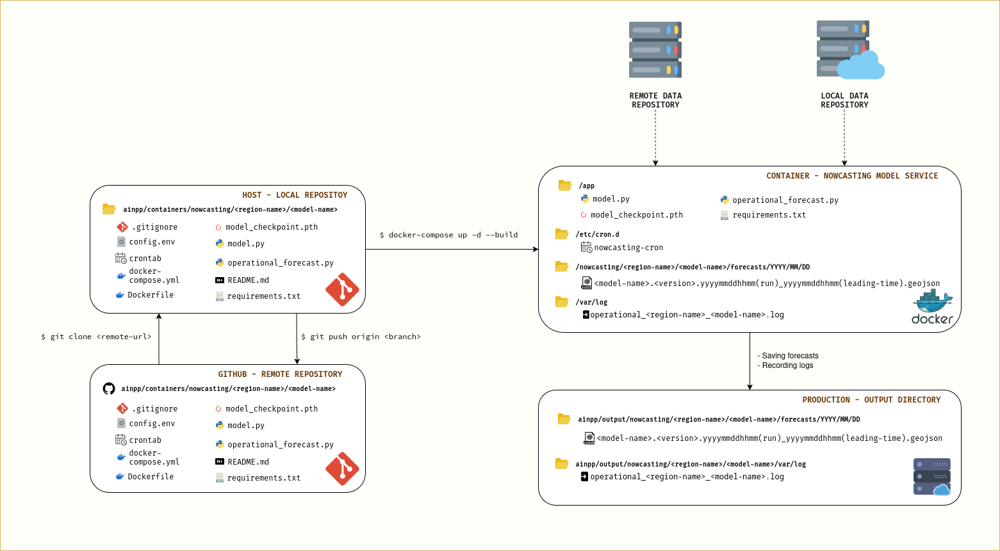

# AINPP Nowcasting Containers

Repository containing source code for operationalizing precipitation nowcasting using multiple Docker containers for different regions and models, developed as part of the Artificial Intelligence Nowcasting Pilot Project (AINPP).

## Architecture Overview

This repository implements a containerized nowcasting model service that processes meteorological data from both remote and local repositories to generate precipitation forecasts across different regions.



### System Components

- **Data Sources**: Remote and local data repositories providing meteorological input
- **Containerized Service**: Docker-based nowcasting model service
- **Output Management**: Structured forecast and log storage system

## Repository Structure

```
ainpp/containers/nowcasting/<region-name>/<model-name>/
├── .gitignore
├── config.env
├── crontab
├── docker-compose.yml
├── Dockerfile
├── model.py
├── model_checkpoint.pth
├── operational_forecast.py
├── requirements.txt
└── README.md
```

## Quick Start

### Prerequisites
- Docker and Docker Compose installed
- Access to meteorological data repositories
- Model checkpoint files

### Build and Run

1. Clone the repository:
```bash
git clone <remote-url>
cd ainpp/containers/nowcasting/<region-name>/<model-name>
```

2. Configure environment variables in `config.env`
```bash
FTP_JAXA_HOST=hokusai.eorc.jaxa.jp
FTP_JAXA_USER=<user-here>
FTP_JAXA_PASSWORD=<password-here>
OUTPUT_ROOT=/nowcasting/<region-name>/<model-name>
CHECKPOINT_PATH=/app/<region-name>_<model-name>_gsmap_mvk.pth # model trained with GSMaP_MVK
PANEL_BACKGROUND=/app/eo_base_2020_clean_3600x1800.png
```

3. Build and start the container:
```bash
docker-compose up -d --build
```

## Container Operation

The nowcasting service automatically:
- Fetches data from configured remote and local repositories
- Processes meteorological data using the specified model
- Generates forecasts in GeoJSON format
- Saves outputs to structured directories by date and time
- Records operational logs for monitoring

### Output Structure

Forecasts and logs are saved to:
```
ainpp/output/nowcasting/<region-name>/<model-name>/
├── forecasts/YYYY/MM/DD/
│   └── <model-name>.<version>.yyyymmddhhmm(run)_yyyymmddhhmm(leading-time).geojson
└── var/log/
    └── operational_<region-name>_<model-name>.log
```

## Configuration

- **Model Settings**: Configure in `model.py` and checkpoint files
- **Environment Variables**: Set data repository URLs and paths in `config.env`
- **Scheduling**: Adjust forecast frequency in `crontab`
- **Docker Settings**: Modify `docker-compose.yml` for resource allocation

## Contributing

1. Fork the repository
2. Create feature branches for new regions or models
3. Follow the established directory structure
4. Test containers locally before submitting pull requests

## Support

For questions and support regarding the Artificial Intelligence Nowcasting Pilot Project (AINPP), please refer to project documentation or contact the development team.